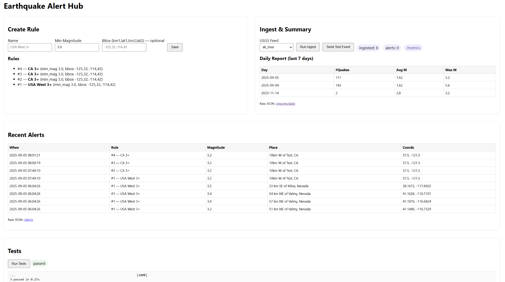

# Earthquake Alert Hub

Earthquake Alert Hub is a production-style FastAPI application that ingests USGS earthquake feeds, stores quakes in SQLite, evaluates alert rules, streams live events, exposes Prometheus metrics, and provides a web UI. Built as the final-semester project for the course *Applications of Software Architecture for Big Data*.


<p align="center">
  
</p>

---

## Features

* **Data collection** from USGS GeoJSON feeds (`all_hour`, `all_day`, `2.5_day`, `4.5_day`, `significant_week`)
* **Rules & alerts**: minimum magnitude + optional bounding box (`lon1,lat1,lon2,lat2`)
* **Persistence**: SQLite database with `quakes`, `rules`, and `alerts`
* **Web UI**: create rules, run ingest, view daily report & recent alerts
* **Live events**: in-memory EventBus + Server-Sent Events (SSE)
* **Metrics**: Prometheus at `/metrics` (ingest count, latency, etc.)
* **Testing**: unit + integration (USGS mocked with `respx`)
* **Run Tests** button **in the UI** (calls `/run-tests`)
* **CI ready**: GitHub Actions workflow included
* **Containerized**: Dockerfile provided
* **One-click Heroku**: Procfile + runtime.txt

---

## Project Structure

```
app/
  db.py               # SQLite schema & helpers
  usgs.py             # USGS fetcher (httpx)
  rules.py            # Rule model & quake matcher
  events.py           # Tiny in-memory EventBus
  main.py             # FastAPI app (UI, events, metrics, /run-tests)
  templates/
    index.html        # Main UI
tests/
  test_unit_rules.py
  test_integration_ingest.py
Dockerfile
requirements.txt
pytest.ini
Procfile
runtime.txt
```

---

## Run locally (recommended)

```bash
# (optional) create a venv
python -m venv .venv
# Windows
. .venv\Scripts\activate
# macOS/Linux
source .venv/bin/activate

pip install -r requirements.txt
uvicorn app.main:app --host 127.0.0.1 --port 8000
# open http://127.0.0.1:8000
```

### What to do in the UI (grader-friendly)

1. **Create Rule**
   Example: `Name = USA West 3+`, `Min Magnitude = 3.0`,
   `BBox = -125,32,-114,42`.
2. **Run Ingest** (pick a feed, e.g., `all_hour`)
   Recent Alerts, Daily Report, and **Live Events** update.
3. **Run Tests** — click the button; a green **passed** badge and raw pytest output appear.

---

## Run with Docker

```bash
docker build -t quake-hub .
docker run --rm -p 8000:8000 quake-hub
# open http://localhost:8000
```

---

## Deploy to Heroku (simple)

**Procfile**

```
web: uvicorn app.main:app --host 0.0.0.0 --port $PORT
```

**runtime.txt**

```
python-3.10.14
```

**Deploy**

```bash
heroku login
heroku create quake-hub-<yourname>
heroku stack:set heroku-22
git push heroku main
heroku ps:scale web=1
heroku open
```

> **Note:** SQLite on Heroku is **ephemeral** (resets on dyno restart). For persistence, attach Postgres (`heroku addons:create heroku-postgresql:mini`) and update `app/db.py` to use `DATABASE_URL`.

---

## API (selected)

* `GET /` — Web UI
* `POST /rules` — Create rule (`name`, `min_mag`, optional `bbox`)
* `GET /rules` — List rules
* `POST //ingest` — Run ingest (`feed` form field)
* `GET /alerts` — Recent alerts (JSON)
* `GET /reports/daily` — 7-day summary (JSON)
* `GET /events/stream` — SSE stream of events
* `POST /events/test` — Publish a test event
* `POST /run-tests` — Run pytest in a subprocess; returns pass/fail + output
* `GET /metrics` — Prometheus metrics

---

## Tests

CLI:

```bash
pytest -q
```

UI: click **Run Tests**. The server executes:

```bash
python -m pytest -q --maxfail=1 --disable-warnings
```

`pytest.ini` ensures imports like `from app.main import app` work:

```ini
[pytest]
pythonpath = .
testpaths = tests
```

---

## CI (GitHub Actions)

The included workflow (`.github/workflows/ci.yml`) installs dependencies and runs `pytest`.
Add a badge to this README after your first run:

```md

```

---

## A-Level Rubric Mapping

* **Web application** (forms/reporting) → UI at `/` ✅
* **Data collection** → USGS fetcher (`app/usgs.py`) ✅
* **Data analyzer** → Daily report (avg/max/count) ✅
* **Data persistence** → SQLite ✅
* **REST collaboration** → FastAPI endpoints ✅
* **Product environment** → Uvicorn app; Dockerfile ✅
* **Integration tests** → `tests/test_integration_ingest.py` ✅
* **Using mocks/fakes** → `respx` mocks USGS ✅
* **Unit tests** → `tests/test_unit_rules.py` ✅
* **Continuous integration** → GitHub Actions ✅
* **Production monitoring** → Prometheus `/metrics` ✅
* **Event collaboration/messaging** → EventBus + SSE ✅
* **Continuous delivery** → Docker + Heroku Procfile ✅

---

## Troubleshooting

* **Two servers on same port**: kill strays, then start again.

  ```powershell
  Get-Process python -ErrorAction SilentlyContinue | Stop-Process -Force
  ```
* **Blank page**: ensure `app/templates/index.html` exists; restart Uvicorn.
* **Docker shows `0.0.0.0:8000`**: browse to `http://localhost:8000`.
* **Tests can’t import `app`**: verify `pytest.ini` has `pythonpath = .` and `app/__init__.py` exists.

---

## License

MIT (or your choice).
